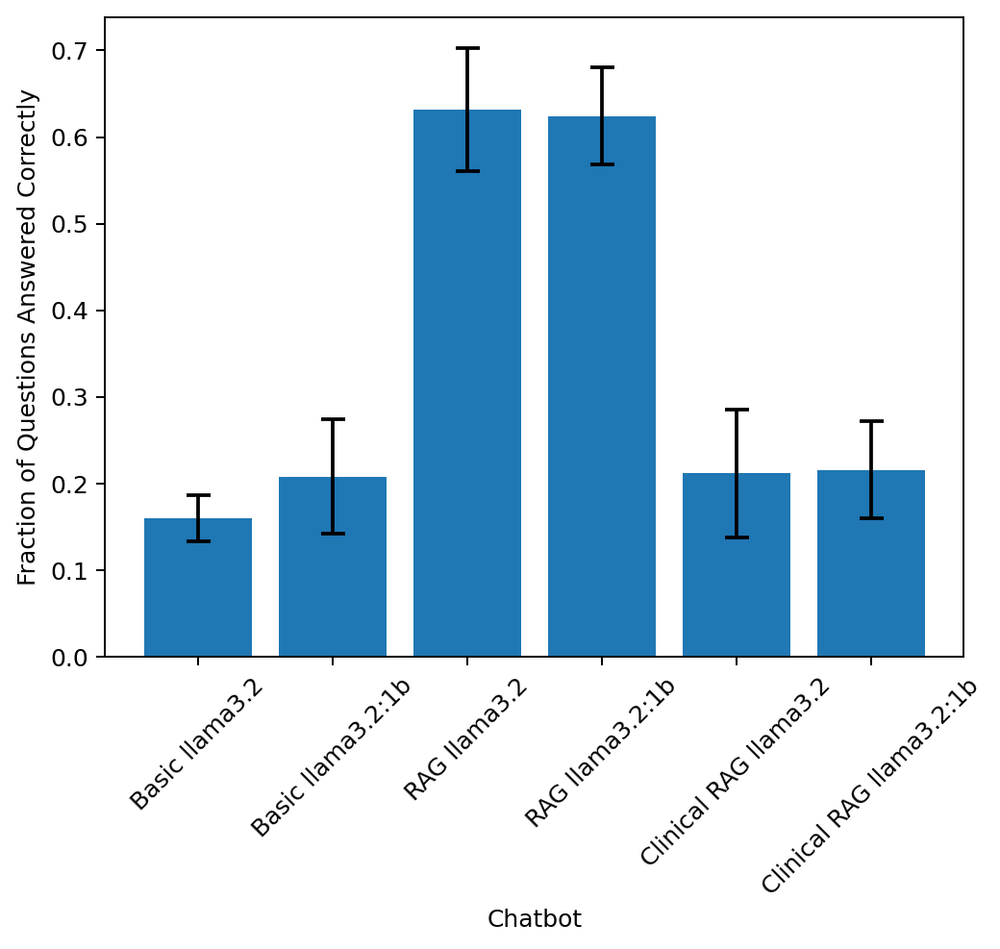
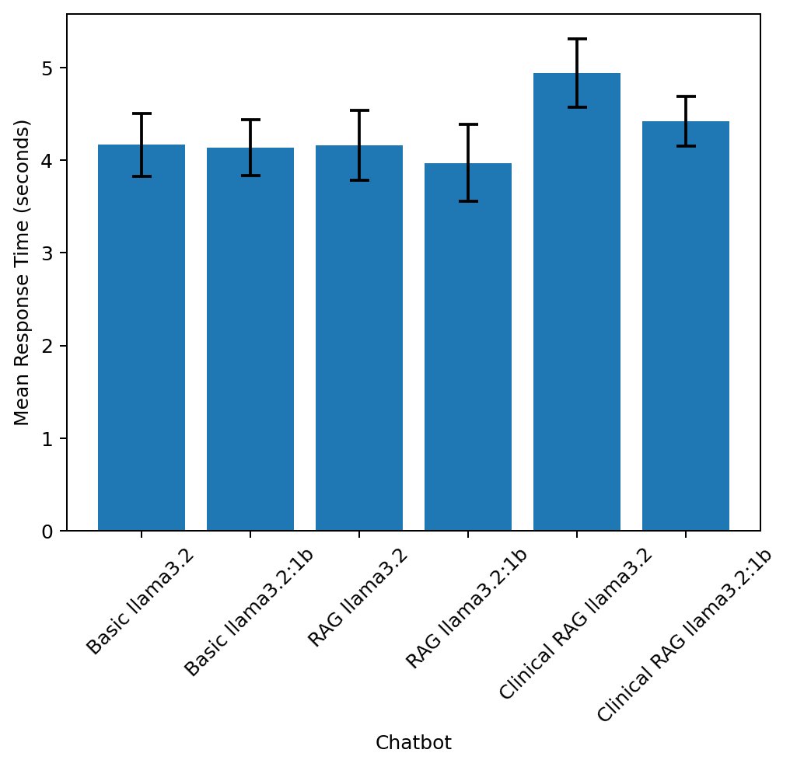

# HER-2 Chatbot Prototype

## Overview
In this repo, I have developed a simple Q/A chatbot prototype for answering questions about [this paper](https://www.science.org/doi/10.1126/science.3798106) published in Science in 1987: *Human breast cancer: correlation of relapse and survival with amplification of the HER-2/neu oncogene.*.

I implemented and evaluated 3 versions of a Q/A chatbot based on open source LLMs:
- A basic version that uses an open source LLM and custom system prompt to act as a chat bot. This version does not have specific access or knowledge to the HER-2 publication.
- A version that uses Retrieval Augmented Generation (RAG). For the RAG chatbot, given a user query, the LLM is provided context from the HER-2 paper as part of its prompt.
- A version that makes use of [recent research](https://github.com/mims-harvard/Clinical-knowledge-embeddings) on clinical knowledge embeddings to perform clinically-aware RAG.

More details follow below.

## Installation and setup

### Easiest way to try the chatbot
The (non-clinical) RAG chatbot is available to test as a (Docker image)[https://hub.docker.com/r/asubbaswamy/her2_chatbot].

If you have Docker installed, running the chatbot is easy.

##### 1. Run `docker pull asubbaswamy/her2_chatbot`
The full image is ~12 GB so this may take a few minutes to download. The image comes with an open source LLM pre-downloaded.
##### 2. Run `docker run -it asubbaswamy/her2_chatbot`

This will load ollama⁠ and start an interactive chatbot session from the command line. Since this image is for demo purposes, it only runs the RAG enabled chatbot with Llama 3.2:1b model. For other variations of the chatbot, and to run my custom evaluation code, you will have to use the Github repository and run the code locally.

### To reproduce all results

The chatbot uses [ollama](https://ollama.com/) for open source LLMs.

##### 1. Install [ollama](https://ollama.com/).

##### 2. Clone the repo. Run `git clone https://github.com/asubbaswamy/her2-chatbot.git`
##### 3. Install requisite python packages. Within the repo directory, run `pip install --no-cache-dir -r requirements.txt`
For reference, the code was developed on an apple silicon mac using Python version 3.11.
##### 4. In a separate terminal, run `ollama serve`.
This makes ollama available to use for the chatbot code.
##### 5. To run the chatbot, run `python src/chatbot.py` with the desired arguments.
The chatbot assumes that the relevant vector databases for RAG have been constructed. If needed, run `python src/make_vector_db.py` before running the chatbot.

Chatbot options include `--no_rag` to disable RAG and use an open source LLM with no context from the paper, `--clinical` to use [clinical knowledge embeddings](https://github.com/mims-harvard/Clinical-knowledge-embeddings) for RAG context retrieval, and `--model [llama3.2 | llama3.2:1b]` to select between two LLMs. Llama 3.2:1b (1 billion parameters) is smaller than its 3 billion parameter counterpart (Llama 3.2). 

## Chatbot Prototype Development
**Tech Stack:** The chatbot uses `ollama` for locally running open-source LLMs, and `langchain` and `Chroma` for context embedding and retrieval for RAG.

**Choice of LLM:** For the prototype, I wanted the chatbot to be able to be run locally on user machines without requiring large compute capacity. This is why I chose to use Llama 3.2 as the base LLM, since these models [were designed to be able to fit on edge and mobile devices](https://ai.meta.com/blog/llama-3-2-connect-2024-vision-edge-mobile-devices/). Specifically, the chatbot provides support for Llama 3.2:3b and Llama 3.2:1b. In the evaluation phase, I measured the effect of the model size/capacity on chatbot factual correctness and response time.

To scale up the chatbot, it would make sense to host it on a server and send user queries to it. Subject to the associated cost, this would allow us to use a host machine with sufficient GPU and memory capacity for running a larger and more powerful base LLM.

**Implementing RAG:** Retrieval Augmented Generation (RAG) allows us to give an LLM specific information without having to finetune or adjust the underlying model weights. This is powerful because it means we can augment the capabilities of LLMs that we may not have the compute (or open source access) to change.

In this case, I used RAG to allow the base LLM to see relevant context from the HER-2 paper. In `src/make_vector_db.py` I first read in the HER-2 pdf and split it into 500 word chunks with 50 word overlap between chunks. I then used the `all-mpnet-base-v2` sentence transformer model to embed the chunks in a `Chroma` vector database. Given a user question, the question is embedded using the sentence transformer, the 3 most similar HER-2 paper chunks are retrieved, and the chunk text is added to the LLM prompt as context for answering the user question.

## Evaluation
For the purposes of the prototype, I prioritized evaluating *factual correctness* and *response time*. I also evaluated 3 types of chatbots: a `BasicChatBot` that does not use RAG (and is entirely reliant on the knowledge of the pretrained LLM), a `RAGChatBot` that implements RAG as described above, and a Clinical `RagChatBot` that used clinical knowledge embeddings to perform RAG. For each of these chatbots, I tested a Llama 3.2:3b and Llama 3.2:1b version to see the effect of the base LLM on accuracy and response time.

**Factual Correctness:** To measure the response accuracy of the chat, I manually defined a set of 25 Questions and Answers based on the HER-2 paper (see `reference_docs/factual_questions.csv`). These questions were purposefully selected to have short, factual answers. This let me define a simple heuristic metric for response accuracy: whether or not the chatbot response contains the "true" answer text.

**Response Time:** I measured response time by computing the time in seconds that it takes the chatbot to respond to a fixed query. I recorded the average response time across 25 runs. Note: I measured these times running the code locally on a mac with apple silicon. When running the chatbot using the Docker container, the response times appear to be slower.

### Results

The correctness plot (error bars are 95% confidence intervals) shows that the standard RAG chatbots significantly outperformed the basic and clinical RAG chatbots. This indicates that my implementation of using the word embeddings for clinical RAG was not effective. However, standard RAG was effective in providing the open source LLM with useful context for answering the questions. Notably, across chatbots, the smaller Llama 3.2:1b variants outperformed. This might be because the outputs from the Llama 3.2:3b models tended to be longer, which may have made the correctness heuristic more difficult to evaluate.

The runtime plots (error bars are 95% confidence intervals) show that the chatbots all had similar runtimes. Interestingly, the Llama 3.2:1b models were not always faster than their larger Llama 3.2:3b counterparts. 

### Other Metrics
Since this implementation is just a prototype, I prioritized response accuracy and response time for the chatbot. However, to more comprehensively evaluate the chatbot, it would also be important to evaluate user experience qualities like *politeness*, *relevancy*, and *brevity*. 

Politeness could be measured by taking a sample of prospective users and having them rate the politeness on a Likert scale. Relevancy, or the ability of the chatbot to stay on topic when asked irrelevant questions, could be measured by creating a list of irrelevant user inputs and asking an LLM to rate if the chatbot response correctly refused to answer. Finally, brevity could be measured by having a subset of users rate if they felt the response they received was too long, too short, or acceptable length.

Measuring these aspects of user experience would be helpful for the **continuous improvement** of the chatbot by collecting data to enable *reinforcement learning from human feedback* (RLHF). This data could be used to train a reward model used to in finetuning the underlying LLM through, e.g., proximal policy optimization (PPO). 

## Assumptions
Beyond the provided assumptions of access to the publication's content and a diverse user base, I assumed that the prototype should not incur cloud hosting costs and should be able to run locally on linux/unix systems.

If the prototype were deemed as promising or successful, it would make sense to scale it by hosting it in the cloud.

## Re: Clinical Knowledge Embeddings
### Assignment Questions
##### 1. What are 3 takeaways from the [clinical knowledge embeddings paper](https://github.com/mims-harvard/Clinical-knowledge-embeddings)?

In this paper, the authors tackle the problem of learning representations of clinical knowledge that are robust to cross-institutional differences. For example, clinical codes are used differently across sites, which means models trained using those codes can fail to capture eneralizable definitions and dependencies among clinical codes.

Three takeaways from the paper are:
- The unified embeddings led to consistent clinician behavior across very different clinical sites. The distribution of clinician scores of code relevance based on the unified embeddings was nearly identical for clinicians in Boston and Israel. This shows that this approach to learning clinical concept embeddings truly is able to help with standardization.
- The unified embeddings retain clinically *predictive* information. When the authors used the embeddings to define clinical risk scores, they were able to stratify patients such that there were significant differences in survival. For example, the group with the top 20% of risk scores for older, male patients with chronic kidney disease had 27% lower survival than the corresponding bottom 20% of risk scores. This shows that unification of the embeddings did not wash out useful predictive signal.
- The embeddings were not trained based on patient data. Because the embeddings and knowledge graph encode inherent clinical knowledge (validated by clinicians in the paper), the graph-transformer embedding-learning approach could have implications for how clinically aware LLM fine-tuning can be performed.

##### 2.	How could this research be important for Humana?
An insurance and healthcare provider company like Humana deals with data coming from a variety of sources, who may each use different formats and encoding schemes. The embedding approach in the paper allows one to learn mappings between clinical concepts across different institutions and coding schemes. Clinical concept-aware AI would allow Humana to more easily and coherently aggregate data across their various clients. 

##### 3.	How can you include this research into your Q/A chatbot?
See below for a description of my approach. I tried to directly take the embeddings available in the paper's repo and use them to enable the chatbot to answer questions about the HER-2 paper. However, given the poor results, it might have been better to use the provided knowledge graph to fine-tune a sentence transformer model such that its embeddings are clinical-concept aware.

#### My Approach
I tried to use the pretrained clinical knowledge embeddings to perform RAG. Because the embeddings are word embeddings, I needed a way to use them to learn representations of sentences and chunks of text. I defined a custom `ClinicalEmbeddings` class in `src/make_vector_db.py` that defines a vocabulary based on the pretrained embeddings and extracts word frequencies in text based on the vocab. Then, a chunk text embedding is computed by taking the term-frequency weighted average of the pretrained embeddings present in that chunk.

I used this ClinicalEmbedding model to perform context retrieval for RAG in the chatbot. As the results showed, it was much less effective than traditional RAG.

## Future Improvements
In no particular order:
- The paper is quite old. When reading the text of the pdf I noticed the extracted text is highly error-prone with some words combined, some words missing characters, and incorrect characters being read. It would be worthwhile to investigate the effectiveness of optical character recognition (OCR) in reading this pdf. It might also be interesting to see if the extracted text could be cleaned by running it through an LLM.
- Noisiness in the clinical word embeddings. The `node_name` text in the clinical word embeddings is noisy (e.g., "%" and "2" are assigned embeddings) and contains multiple entries for the same clinical concept (see, e.g., "Colic" and "Colic [D]"). Thus, figuring out how to best create sentence embeddings based on these word embeddings is difficult. A more promising, but more involved, approach might be to use the clinical knowledge graph to fine-tune a sentence embedding model.